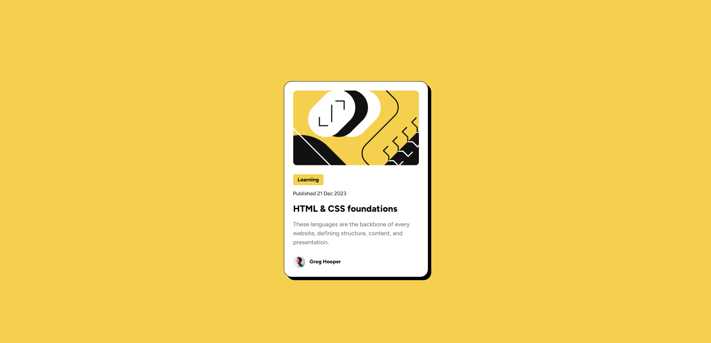

# Frontend Mentor - Blog preview card solution

This is a solution to the [Blog preview card challenge on Frontend Mentor](https://www.frontendmentor.io/challenges/blog-preview-card-ckPaj01IcS). Frontend Mentor challenges help you improve your coding skills by building realistic projects.

## Table of contents

- [Overview](#overview)
  - [The challenge](#the-challenge)
  - [Screenshot](#screenshot)
  - [Links](#links)
- [My process](#my-process)
  - [Built with](#built-with)
  - [What I learned](#what-i-learned)
- [Author](#author)

## Overview

### The challenge

Users should be able to:

- See hover and focus states for all interactive elements on the page

### Screenshot

### Links

- Solution URL: [Solution](https://github.com/kalihari90/frontend-mentor-2)
- Live Site URL: [Live](https://kalihari90.github.io/frontend-mentor-2/)

## My process

### Built with

- Semantic HTML5 markup
- CSS custom properties
- Flexbox
- CSS Grid

### What I learned

I've learned using more information about sizes and spaces from figma file. I used it and planned my code better - for example using flexbox with gaps for spacing elements. The most challenging thing was making perfect yellow label "Learning", because when I used flexbox it's turned into block element even when I changed display property do "inline-block". Propably display wasn't problematic but default flexbox behavior which makes all content take all free space like block elements do. I just put that label word into span and it works fine.

## Author

- Frontend Mentor - [@kalihari90](https://www.frontendmentor.io/profile/kalihari90)
